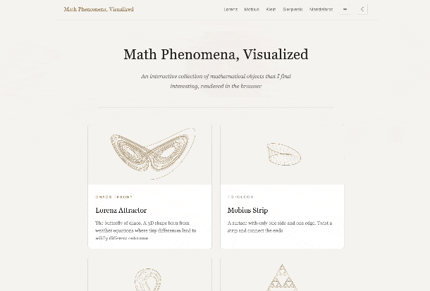

# Math Phenomena, Visualized

[](./LICENSE)
[](https://developer.mozilla.org/en-US/docs/Web/HTML)
[](https://developer.mozilla.org/en-US/docs/Web/CSS)
[](https://developer.mozilla.org/en-US/docs/Web/JavaScript)
[](https://plotly.com/javascript/)
[](https://pages.github.com/)

Interactive math visualizations that run in the browser. Covers chaos theory, topology, and fractals, all on a single page with tab switching and no reloads.

**[View Live](https://pklauv.github.io/Math-Phenomena/)**

> **Tip:** Press <kbd>?</kbd> anywhere on the site to see all keyboard shortcuts, or click the keyboard button in the nav bar.

---

## Quick Demo:


## :art: Visualizations

- **Lorenz Attractor**: Animated 3D trajectory of the classic chaotic system. Includes a camera orbit, the differential equations, and the story of how Lorenz stumbled onto chaos in 1963.

- **Mobius Strip**: A one-sided surface you can rotate and explore. Sliders let you change the number of half-twists and the strip width.

- **Klein Bottle**: A surface with no inside or outside, shown as a figure-8 immersion in 3D. Auto-rotates, with an opacity slider to see the self-intersection.

- **Sierpinski Triangle**: Built two ways: recursive subdivision and the chaos game. Watch it animate depth by depth, or see 50,000 random points converge into a fractal.

- **Mandelbrot Set**: Click-to-zoom fractal explorer with adjustable iteration count and multiple color palettes.

## :sparkles: Features

- **Single-page app**: Everything lives on one page with tab switching, no full page reloads
- **Hash routing**: Links like `index.html#lorenz` go directly to a visualization, and back/forward work as expected
- **Lazy loading**: Each visualization only initializes when you first open its tab, and Plotly.js (~3.5 MB) is loaded on demand so canvas-based tabs never download it
- **Pause/resume**: Leaving a tab pauses its animation; coming back resumes it
- **Mobile support**: Responsive layout with a scrollable tab bar on small screens
- **Educational write-ups**: Each page has equations (MathJax), parameter tables, and explanations written in plain language
- **Dark/light theme**: toggle in the nav bar, remembers your preference, and respects system settings
- **Keyboard shortcuts**: press `?` or click the ⌨ button in the nav bar to see all shortcuts. Space to pause, R to reset, number keys to switch tabs
- **Accessible**: ARIA roles, focus indicators, screen reader announcements, and full keyboard navigation

## :hammer_and_wrench: Built With

| Category | Tech |
|----------|------|
| 3D Plots | [Plotly.js](https://plotly.com/javascript/) (Lorenz, Mobius, Klein) |
| Math Rendering | [MathJax](https://www.mathjax.org/) for LaTeX |
| 2D Fractals | HTML5 Canvas (Sierpinski, Mandelbrot) |
| Backend | [Supabase](https://supabase.com/) for feedback form |
| Testing | [Playwright](https://playwright.dev/) for E2E tests |
| Core | Vanilla HTML, CSS, and JS. No build tools or frameworks. |

---

## :brain: What I Learned

<details>
<summary><strong>JavaScript</strong></summary>

- **Module pattern (IIFE)** for encapsulating each visualization so nothing leaks into global scope
- **`requestAnimationFrame`** for smooth 60fps animation loops (Lorenz orbit, Sierpinski depth stepping)
- **Web Workers** for off-thread computation so the Mandelbrot renderer doesn't freeze the UI
- **`async/await`** with Supabase for inserting feedback and handling anonymous auth
- **Page Visibility API** to pause animations when the tab is hidden and resume on return
- **Hash-based routing** with `popstate` to make back/forward buttons work in a single-page app
- **Debounced resize handlers** so Plotly relayouts and canvas redraws don't fire on every pixel of a window drag
- **`Float64Array` / typed arrays** for passing pixel data between the main thread and the Mandelbrot worker
- **Canvas 2D API**
  - Direct pixel manipulation with `ImageData`
  - Drawing primitives for Sierpinski triangles
  - DPR scaling so fractals look sharp on retina screens
- **Force reflow trick** (`offsetHeight` read) to restart CSS transitions on tab switches
- **Keyboard shortcut system** with a help modal, using `keydown` listeners and key mapping
- **ARIA integration** for live regions, role attributes, and focus management to support screen readers
- **Lazy-loading third-party scripts** by injecting `<script>` tags on demand, saving ~3.5 MB on initial load
- **`IntersectionObserver`** to defer loading resources until they scroll into view
- **Memory cleanup patterns**: freeing large arrays after they're consumed by a rendering library

</details>

<details>
<summary><strong>CSS</strong></summary>

- **CSS custom properties** (`--bg`, `--text`, `--accent`) for consistent light/dark theming
- **CSS Grid and Flexbox** for page layout, tab bars, and card grids
- **`backdrop-filter: blur()`** for a glassmorphic look on panels and overlays
- **Responsive design** with media queries to collapse the tab bar and stack content on mobile
- **Transitions and transforms** for hover effects, tab fade-ins, and card animations
- **Vendor prefixes** (`-webkit-backdrop-filter`, `-moz-`) for cross-browser support
- **`prefers-reduced-motion`** media query to disable animations for users who are sensitive to motion
- **`will-change` and `contain`** properties as performance hints (learned that these are micro-optimizations with limited real-world impact at small scale)

</details>

<details>
<summary><strong>Math and Algorithms</strong></summary>

- **Lorenz system**: numerically integrating a system of three coupled ODEs with a fixed time step
- **Parametric surfaces**: generating meshes for the Mobius strip and Klein bottle from parametric equations
- **Recursive fractal subdivision**: splitting triangles into smaller triangles for the Sierpinski triangle
- **Chaos game algorithm**: picking random vertices and plotting midpoints to grow a Sierpinski triangle from noise
- **Mandelbrot escape-time iteration**: iterating `z = z^2 + c` and using smooth coloring with the normalized iteration count
- **Complex number arithmetic**: mapping pixel coordinates to the complex plane and zooming into regions

</details>

<details>
<summary><strong>Web Dev and Tooling</strong></summary>

- **Single-page app architecture** without a framework: one HTML shell, JS modules with `init/pause/resume`, and a tab controller
- **Lazy initialization pattern** so each visualization only loads when its tab is first opened
- **GitHub Pages deployment** from the repo root
- **Supabase integration** for a feedback form (database inserts + anonymous auth, no server needed)
- **MathJax** for rendering LaTeX equations inline with the educational write-ups
- **Plotly.js** for interactive 3D surface and scatter plots with custom camera angles
- **Playwright end-to-end testing** across desktop, tablet, and mobile viewports
- **Performance tests that verify lazy-loading behavior**, checking that a library is absent until a specific user action triggers it
- **Visual regression testing** with screenshot baselines

</details>

---

## :open_file_folder: Project Structure

```
index.html                 - SPA shell with all tab panels
css/shared.css             - shared styles, transitions, viz component classes
js/tab-controller.js       - tab switching, hash routing, lazy init
js/viz-lorenz.js           - Lorenz attractor module
js/viz-mobius.js            - Mobius strip module
js/viz-klein.js             - Klein bottle module
js/viz-sierpinski.js        - Sierpinski triangle module
js/viz-mandelbrot.js        - Mandelbrot set module
js/mandelbrot-worker.js     - Web Worker for off-thread Mandelbrot rendering
js/viz-shared.js            - shared constants, Plotly helpers, theme toggle, keyboard shortcuts
js/mandelbrot-palettes.js   - color palettes shared between main thread and worker
visualizations/*.html       - standalone pages (kept for backward compat)
playwright.config.js        - E2E test configuration
package.json                - npm scripts and dev dependencies
tests/navigation.spec.js    - tab switching and hash routing tests
tests/interactions.spec.js  - visualization controls and UI interaction tests
tests/accessibility.spec.js - ARIA roles, focus management, keyboard nav tests
tests/performance.spec.js   - lazy-loading and resource-timing tests
tests/screenshots.spec.js   - visual regression screenshot tests
```

## :seedling: How This Project Evolved

This repo started as a Python primer with a virtual environment and a requirements file. It changed direction when I added a 3D Lorenz attractor using Plotly.js. I spent a while getting the animation smooth, tuning the camera, and writing up the math and history behind it.

From there I added four more visualizations: the Mobius strip, Klein bottle, Sierpinski triangle, and Mandelbrot set. Each one got its own page with a shared nav bar and dark theme. The landing page had a card grid with canvas thumbnails.

The Klein bottle page needed several rounds of fixes to work properly on mobile. Layout and rendering issues kept coming up.

The biggest structural change was consolidating everything into a single-page app. Each visualization became its own JS module with `init/pause/resume` methods, and a tab controller handles routing, lazy loading, and fade transitions. No more full page reloads.

Getting the Lorenz animation to run smoothly took several rounds of optimization. The first version worked but stuttered. I went through multiple passes tuning `requestAnimationFrame`, trimming unnecessary redraws, and profiling frame rates until it ran at a steady 60fps.

I also ran into a bug where scrolling over a running animation caused visual glitches. The fix was adding pause logic that detects when a visualization leaves the viewport. Small thing, but it taught me about browser rendering quirks you only find by actually using the page.

At one point I renamed and refocused the entire repo around the Lorenz attractor before expanding scope again. That taught me something about project direction: it's fine to narrow down and then grow back out.

Dark/light theming, keyboard shortcuts, and accessibility weren't added one feature at a time. They came together in a single large refactoring pass. Touching every module at once forced me to think about consistency across the whole app.

Adding a Supabase feedback form was the first time I connected a third-party backend service. Anonymous auth, a database insert, and a simple form. No server of my own, just wiring up an API.

The most recent commit bundled lazy-loading (Plotly + Supabase), a Playwright test suite, accessibility improvements, and visual polish. Lazy-loading Plotly (~3.5 MB) was the biggest win: users on the home page or canvas-based tabs never download it. The Playwright test suite (navigation, interactions, accessibility, performance, visual regression) was the most important infrastructure addition, giving the project real test coverage for the first time. `prefers-reduced-motion` support and a sticky mobile nav were practical improvements. Some changes (scroll-reveal animations, `will-change`/`contain` CSS hints, memory cleanup) were minor or cosmetic and didn't meaningfully change the user experience.

> What started as a Python primer turned into a deep dive into browser graphics, math, and vanilla JS architecture.

This project was also a hands-on experiment with git, GitHub, and building things alongside AI. Most of the math, visualizations, and code were built with the assistance of AI tools. I don't claim original ownership of the math or the code. The goal was to learn by doing: practicing version control, working with GitHub Pages, and figuring out how to collaborate with AI to build something real.

## :page_facing_up: License

[MIT](./LICENSE)
